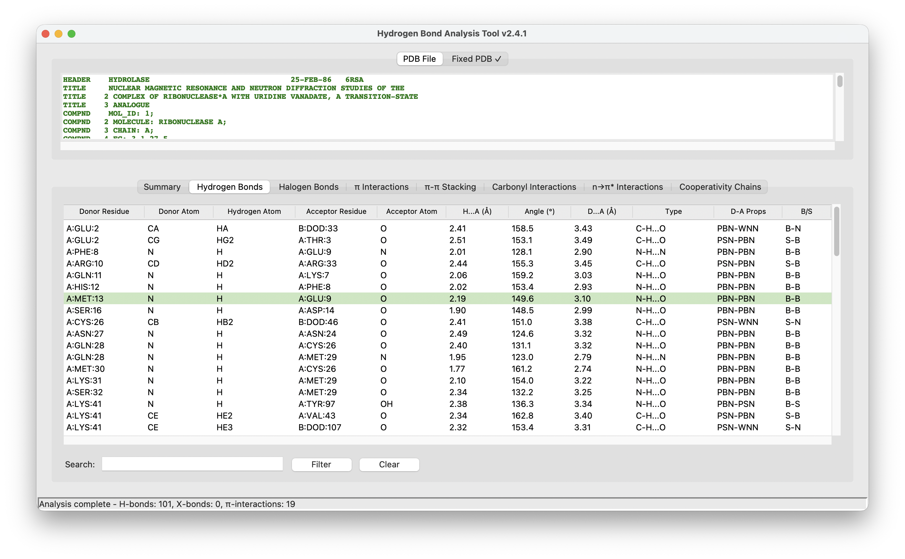
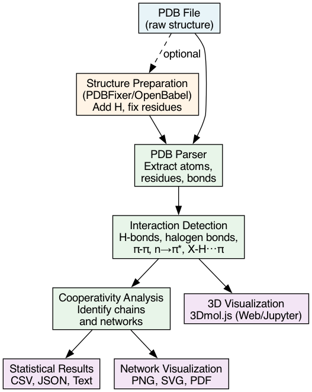
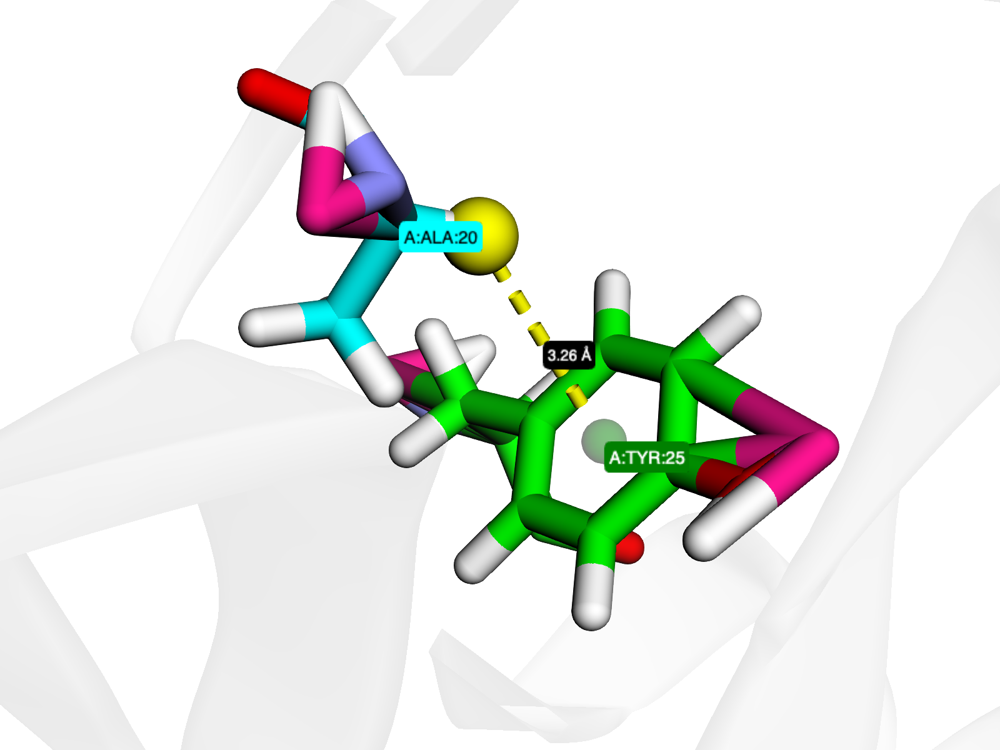
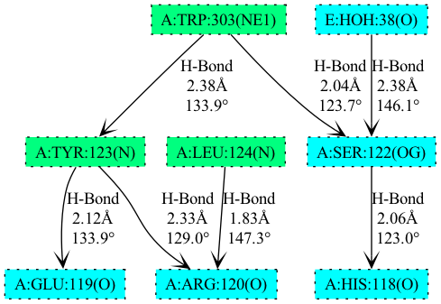

# Summary

HBAT 2 is a Python package for automated analysis of hydrogen bonds and other non-covalent interactions in macromolecular structures available in Protein Data Bank (PDB) file format. The software identifies and analyzes traditional hydrogen bonds, weak hydrogen bonds, halogen bonds, X-H$\cdots$$\pi$ interactions, $\pi$-$\pi$ stacking, and n$\rightarrow$$\pi$* interactions using geometric criteria. HBAT 2 also detects cooperativity and anticooperativity chains and renders them as interactive 2D network visualizations. Originally developed in Perl/Tk and published in 2007 [@tiwari2007hbat], HBAT 2 has been completely rewritten in Python with a modern cross-platform `tkinter`-based graphical user interface (GUI), web-based interface[^1], command-line interface (CLI), and developer-friendly API. The software also provides JavaScript-based 3D visualization available both on the web server[^1] and as an interactive widget in Jupyter notebooks, enabling researchers to interactively explore structures without requiring separate visualization software. Example Jupyter notebooks with shortcuts to launch in Google Colab—a free hosted service requiring no local setup—are provided[^2] to facilitate reproducible computational workflows. This comprehensive suite of interfaces makes HBAT 2 accessible to researchers with diverse computational backgrounds, from experimental biologists to computational specialists.

[^1]: [https://hbat-web.abhishek-tiwari.com](https://hbat-web.abhishek-tiwari.com)
[^2]: [https://github.com/abhishektiwari/hbat/tree/main/notebooks](https://github.com/abhishektiwari/hbat/tree/main/notebooks)

# Statement of Need

Hydrogen bonds and other non-covalent interactions are fundamental to protein structure, stability, and biological function. They determine how proteins fold, how they recognize their targets, and how drugs bind to disease-causing proteins. With over 200,000 protein structures archived in the Protein Data Bank [@berman2000protein], there is an increasing need for automated tools to systematically analyze these critical interactions.

The target audience includes structural biologists studying protein mechanisms, computational chemists designing new drugs, protein engineers improving enzyme properties, and researchers analyzing molecular dynamics simulations. These researchers need to quickly identify and quantify weak interactions from hundreds of thousands of protein structures to answer biological questions about molecular function and evolution.

The original HBAT [@tiwari2007hbat] was developed in Perl/Tk with a Windows-only GUI, limiting its adoption in modern computational environments where researchers use diverse operating systems (Windows, Linux, macOS) and integrate analyses into Python-based scientific workflows. This update addresses these limitations while expanding the types of interactions analyzed.

# State of the Field

The landscape of hydrogen bond analysis tools is diverse but fragmented. Classic tools like HBPLUS [@mcdonald1994satisfying] and HBexplore [@lindauer1996hbexplore] pioneered automated H-bond detection but lack modern interfaces and support for diverse interaction types. More recent specialized tools include: PLIP [@salentin_plip_2015] and Arpeggio [@jubb_arpeggio_2017], which excel at protein-ligand interactions but are web-based without standalone GUI options; HBonanza [@durrant_hbonanza_2011], HBCalculator [@wang_hbcalculator_2024], and BRIDGE2 [@siemers_interactive_2021], which focus on molecular dynamics trajectories rather than static structures; MDAnalysis [@noauthor_431_nodate], GROMACS [@noauthor_gmx_nodate], and AMBER [@noauthor_hbond_2020], which provide H-bond analysis within larger simulation suites. Tools like VMD [@noauthor_vmd_nodate] and ChimeraX [@noauthor_tool_nodate] offer interactive visualization but limited statistical analysis capabilities. ProteinTools [@ferruz_proteintools_2021] provides web-based network analysis but lacks cross-platform desktop functionality.

HBAT 2 uniquely fills this gap by providing: (1) comprehensive analysis of diverse interaction types beyond canonical hydrogen bonds, (2) both graphical and command-line interfaces for different research workflows, (3) identification of cooperativity networks in static structures, (4) seamless integration with Python scientific workflows, and (5) flexible parameter customization with domain-specific presets optimized by structural biology best practices. The modular Python architecture enables both interactive exploration through the GUI and programmatic access through the API, supporting research at all computational skill levels.

# Software Design

HBAT 2 employs a modular architecture with distinct components for PDB parsing, geometric analysis, statistical computation, and network visualization. The core analysis engine uses efficient nearest-neighbor searching with configurable distance cutoffs, followed by geometric filtering based on distance and angular criteria. This fundamental approach matches the original HBAT [@tiwari2007hbat] but with optimized algorithms for modern computing environments.

Key design decisions include: (1) Python for accessibility and integration with scientific ecosystems; (2) optional integration with PDBFixer [@noauthor_openmmpdbfixer_2025; @eastman_openmm_2013] and OpenBabel [@oboyle_pybel_2008] for automated structure preparation, addressing real-world challenges of missing atoms and incomplete side chains; (3) support for multiple interaction types reflecting advances in weak interaction chemistry [@desiraju_weak_2001; @cavallo_halogen_2016; @brandl_c-h-interactions_2001]; (4) preset parameter systems for common experimental conditions (high-resolution X-ray, NMR, membrane proteins, drug design) that balance accessibility for experimentalists with flexibility for computational experts; and (5) multiple output formats (CSV, JSON, network graphics in PNG/SVG/PDF) enabling integration into downstream analysis pipelines.

The software analyzes hydrogen bonds (O-H$\cdots$O, N-H$\cdots$O, N-H$\cdots$N, C-H$\cdots$O), halogen bonds (C-X$\cdots$Y where X=F,Cl,Br,I), X-H$\cdots$$\pi$ interactions, $\pi$-$\pi$ stacking [@mcgaughey_pi-stacking_1998; @vernon_pi-pi_nodate], carbonyl-carbonyl n$\rightarrow$$\pi$* interactions [@rahim_reciprocal_2017; @newberry_n_2017], and n$\rightarrow$$\pi$* interactions [@choudhary_nature_2009]. Network visualization uses either NetworkX/Matplotlib [@hagberg2008networkx; @hunter2007matplotlib] or GraphViz [@graphviz2024], emphasizing cooperativity chains and network topology with customizable layouts and high-resolution export.

# Research Impact Statement

Since its original publication, HBAT has been [cited more than 81 times](https://scholar.google.com/citations?view_op=view_citation&hl=en&user=Mb7eYKYAAAAJ&citation_for_view=Mb7eYKYAAAAJ:u-x6o8ySG0sC) in numerous studies spanning multiple research domains [@tiwari2007hbat]. HBAT has been used for:

**Structure-based drug design**: Researchers have used HBAT to characterize protein-ligand interactions for anticancer compounds targeting ABL kinase [@diaz-cervantes_molecular_2020], analyze cardiovascular disease receptors with metabolite interactions [@ravindran_interaction_2015], predict drug resistance based on hydrogen bond patterns [@zhou_prediction_2013], and elucidate anticoagulant interactions [@russo_krauss_thrombinaptamer_2011].

**Protein engineering**: HBAT enabled identification of stabilizing C-H$\cdots$$\pi$ and C-H$\cdots$O interactions in thermostable enzyme variants [@wang_simultaneously_2020] and characterization of hydrogen bonding networks for functional specificity [@fournier_vanadium_2014].

**Molecular dynamics analysis**: The tool has been used to characterize interactions in viral proteins important for understanding RNA encapsulation [@huang_kernel_2009], glycoprotein interactions for cellular quality control [@jayaprakash_atomic_2025], and DNA structural dynamics [@barzegar_stabilization_2025].

**Comparative structural analysis**: HBAT has enabled systematic mutation analysis identifying disease-associated variants in cancer genes [@kavitha_insights_2024; @khan_prediction_2017; @khan_identification_2018; @abdulazeez_rs61742690_2019; @abdulazeez_-silico_2016].

**Recent citations**: Recent applications include biosorption and molecular docking studies utilizing HBAT 2 for hydrogen bond analysis in environmental remediation [@mehmet_karadayı_removal_2026].

HBAT 2 extends this demonstrated impact by providing modern cross-platform access, expanded interaction coverage, and integration with contemporary Python workflows, supporting growing adoption across diverse research applications. HBAT 2 demonstrates strong adoption with approximately [20,000 monthly downloads](https://pypistats.org/packages/hbat), indicating widespread use within the structural biology research community. 

# AI Usage Disclosure

Generative AI tools were used during the development of HBAT 2 and this manuscript. AI tools were used for porting original HBAT in Perl to Python. Subsequently, AI tools were used for refactoring, test scaffolding, and documentation generation for portions of the codebase. AI tools were also used to assist with drafting and editing portions of this manuscript. All AI-assisted code and documentation outputs were reviewed, edited, validated, and tested by the human author, who takes full responsibility for the final software and paper. No figures or data were generated by AI.

# Acknowledgements

The author thanks the original co-developer Sunil K. Panigrahi and acknowledges the structural biology community for feedback that guided the modernization of HBAT. Special thanks to users who tested HBAT 2 during development and provided valuable feedback.

# References